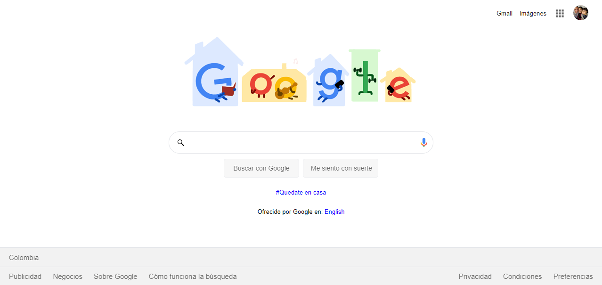

# Clon Google using HTML and CSS

En este proyecto se quiere evidenciar los conocimiento adquiridos en el curso práctico de HTML y CSS tomado en Platzi y dirigido por Diego DeGranda.

El objetivo es replicar la página de Bienvenida de Google usando únicamente HTML y CSS básico.

